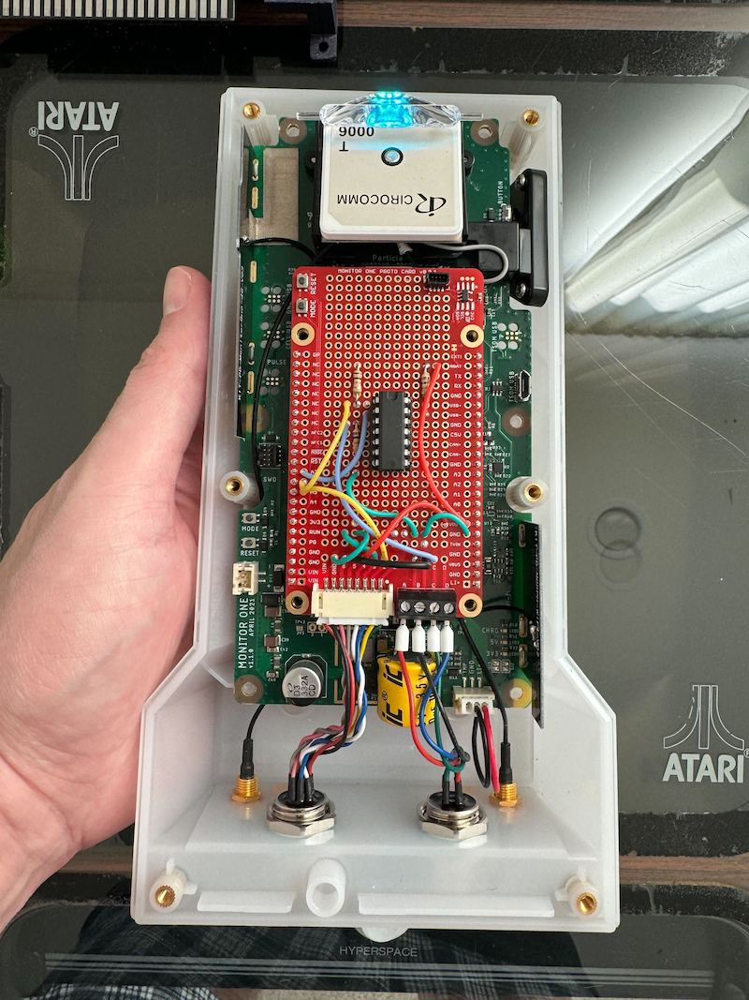
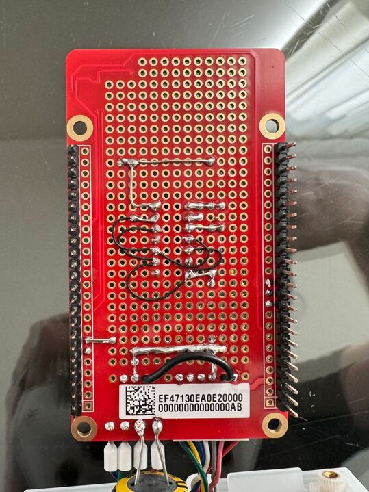
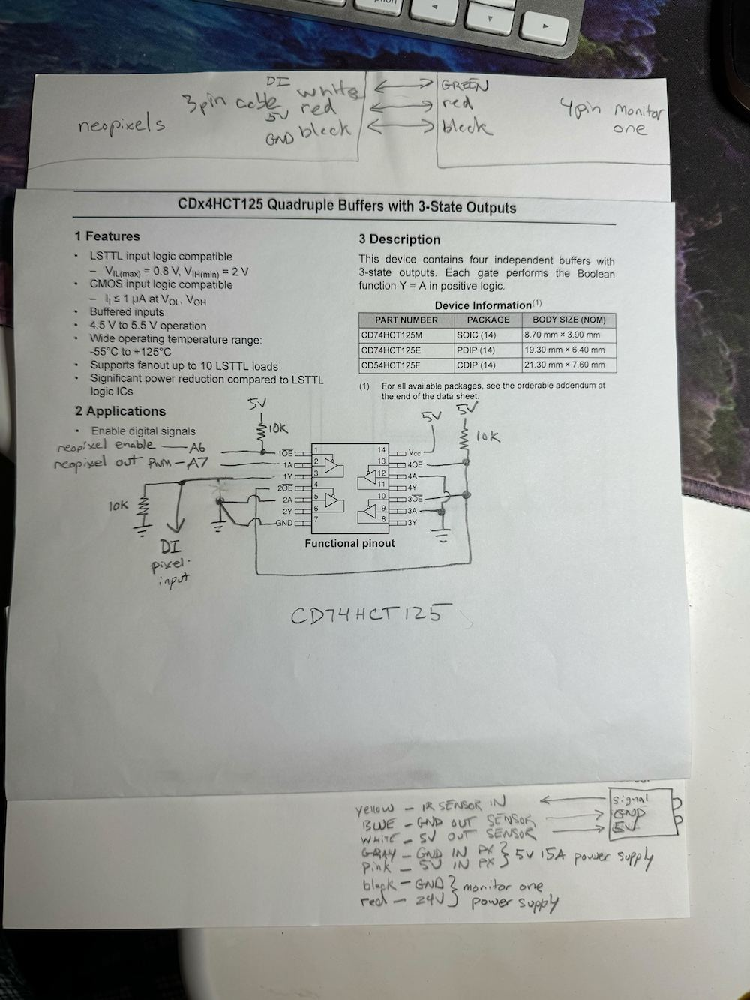

# Monitor One based Prize Wheel 

If you stopped by the Particle booth for the 2023 Bay Area Maker Faire, spun the prize wheel, and were lucky enough to win our badge, we hope you had a blast playing! 

This prize wheel showcased the [Particle Monitor One](https://www.particle.io/devices/monitor-one/) with a simple task of monitoring the rotation of an off-the-shelf prize wheel, and displaying a cool and exciting animation with 432 high density neopixels.  The idle state is a gentle flow of cyan color decending from the Monitor One.  When the wheel is spun, the IR make-break sensor detects the pieces of electrical tape attached to the back of the wheel, and changes the neopixel colors for each segment of the wheel.  The colors and flow of light suggests data flowing up into the Monitor One.  Also Monitor One's RGB LED is synchronized to the neopixels.  When the wheel stops, a sparkly light show greets the winner for a few seconds.

## In action


## Protocard wiring





## Software

```
code (firmware)
build (firmware build directory)
```

### Compiling

To build the prize wheel firmware, connect a Monitor One over USB and run:

```
cd build
./build.sh 5.5.0
```

# License

Creative Commons Attribution-ShareAlike 4.0 International (CC BY-SA 4.0) - essentially do whatever you want, Full [LICENSE here](LICENSE)
